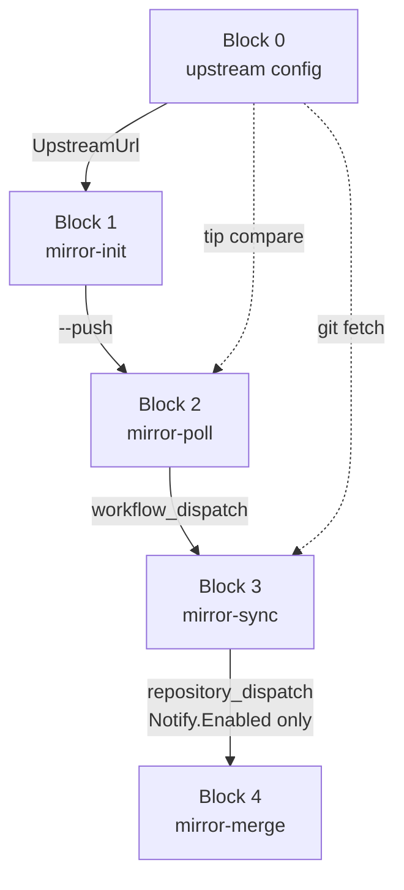

# MSYS2-APISS mirror pipeline architecture

**Center design** for the MSYS2-APISS sync pipeline. Edit this file first when changing
repos, blocks, CI boundaries, or operator flows.

**Block IDs:** 0 config -> 1 **mirror-init** -> 2 **mirror-poll** -> 3 **mirror-sync** -> 4 **mirror-merge**.

| Block | Name | CLI / workflow |
|-------|------|----------------|
| **1** | mirror-init | `yarn mirror-init` (`fetch-mirrors`) |
| **2** | mirror-poll | `yarn mirror-poll`, `mirror-poll.yml` |
| **3** | mirror-sync | `mirror-sync.yml` on mirror branch **`msys2-apiss-mirror-sync`** |
| **4** | mirror-merge | `yarn sync`, `mirror-merge.yml` on branch **`msys2-apiss-mirror-merge`** |

---

## Detail docs

| Area | Detail doc |
|------|------------|
| Blocks 1-3: mirror-init, mirror-poll, mirror-sync | [`plan-mirror-init.md`](plan-mirror-init.md) |
| Block 4: mirror-merge replay algorithm and destination branches | [`plan-sync-merge.md`](plan-sync-merge.md), [`PLAN.md`](PLAN.md) |
| Operator commands and local testing | [`usage.md`](usage.md), [`run-local.md`](run-local.md) |

---

## Principles

| Principle | Detail |
|-----------|--------|
| **Entry point** | **Local checkout** of [`msys2-apiss/msys2-apiss-sync`](https://github.com/msys2-apiss/msys2-apiss-sync) -- all operator commands run here |
| External upstream | `UpstreamUrl` in `config/mirror-sync/*.json` only; not a workflow actor |
| Block 1 init | From **msys2-apiss/msys2-apiss-sync** code/templates: **initialize Block 3** on each `msys2-apiss/*` mirror (branch **`msys2-apiss-mirror-sync`**) and **Block 4 CI** on tooling branch **`msys2-apiss-mirror-merge`**. Every `yarn mirror-init` run deploys/repairs these; **`yarn mirror-init --push`** pushes to the **msys2-apiss** org and triggers Block 2 |
| Block 2 poll | Compare tips; **trigger Block 3** when behind. Runs via **`yarn mirror-poll`**, **`mirror-poll.yml`** cron, or **`yarn mirror-init --push`** (after push) |
| Block 3 mirror-sync | On each **`msys2-apiss/*` mirror repo**; **only configured mirrors** (e.g. `MSYS2-packages`, `MINGW-packages` with `Notify.Enabled`) dispatch Block 4 CI |
| Block 4 mirror-merge | `yarn sync` locally **or** [`mirror-merge.yml`](../config/mirror-template/mirror-merge.yml) CI; replay + `git push` to `msys2-apiss/msys2-apiss` on `upstream*` |
| Git surface | TypeScript wraps `git` subprocesses only |

---

## msys2-apiss org (Block 1 scope)

All Block 1 init code lives in **`msys2-apiss/msys2-apiss-sync`**. Block 1 prepares the
**msys2-apiss** GitHub org for Blocks 3-4:

| GitHub repo | Block 1 role |
|-------------|--------------|
| **`msys2-apiss/msys2-apiss-sync`** (tooling) | Source of templates + TypeScript; install Block 4 [`mirror-merge.yml`](../config/mirror-template/mirror-merge.yml) on branch **`msys2-apiss-mirror-merge`** |
| **`msys2-apiss/*`** (mirror repos) | Install Block 3 [`mirror-sync.yml`](../config/mirror-template/mirror-sync.yml) + `mirror-sync.json` on branch **`msys2-apiss-mirror-sync`**; bootstrap `.work/mirrors/<repo>/` locally |
| **`msys2-apiss/msys2-apiss`** (destination) | No workflow install; Block 4 replays into `upstream*` (Block 1 does not run replay) |

With **`--push`**, Block 1 pushes mirror workflow branches and content to **`msys2-apiss/*`**
and the Block 4 workflow branch to **`msys2-apiss/msys2-apiss-sync`**, then triggers Block 2.

---

## Repo map

| Repo | Stores code? | GitHub workflow? | Receives |
|------|--------------|------------------|----------|
| `msys2-apiss-sync` (tooling repo) | Yes (TypeScript + templates) | Block 2: `mirror-poll.yml` on `main`; Block 4: `mirror-merge.yml` on branch **`msys2-apiss-mirror-merge`** (installed by Block 1) | Block 3 `repository_dispatch` (package mirrors) |
| `msys2-apiss/*` (mirror repos) | No (content only) | Block 3: `mirror-sync.yml` on mirror branch `msys2-apiss-mirror-sync` (installed by Block 1) | Block 2 `workflow_dispatch`; updates mirror `master` |
| `msys2-apiss/msys2-apiss` (destination) | No (replay output only) | None | `git push` on `upstream*` from Block 4 |
| `msys2/*`, SourceForge, etc. | N/A | N/A | Block 2 reads upstream tip via `ls-remote` |

---

## Target workflow (by block)

| Block | Repo | Workflow | Command / runs | Git / I/O | Output |
|-------|------|----------|----------------|-----------|--------|
| **0** | External (`msys2/*`, SourceForge, ...) | None | Config only | `UpstreamUrl` in `config/mirror-sync/*.json` | -- |
| **1** | `msys2-apiss/msys2-apiss-sync` (**local checkout**) | None | `yarn mirror-init` (`fetch-mirrors`) `[--push] [--repo <name>]` | From tooling repo code: initialize Block 3 on **`msys2-apiss/*`** + Block 4 CI branch on tooling; with **`--push`**: push to msys2-apiss org then Block 2 | Block 3/4 workflows deployed; **`--push`**: Block 2 triggered |
| **2** | `msys2-apiss/msys2-apiss-sync` (local or CI) | [`mirror-poll.yml`](../.github/workflows/mirror-poll.yml) on `main` (cron) | `yarn mirror-poll`; **`yarn mirror-init --push`** (after push); CI cron | Poll only; `workflow_dispatch` Block 3 when behind | Block 3 triggered |
| **3** | **`msys2-apiss/*` mirror repos** | [`mirror-sync.yml`](../config/mirror-template/mirror-sync.yml) on mirror branch `msys2-apiss-mirror-sync` | Block 2 dispatch | Fetch upstream; push mirror `master` | Mirror updated; **if `Notify.Enabled`**: dispatch Block 4 CI (e.g. `MSYS2-packages`, `MINGW-packages`) |
| **4** | Tooling repo (CI) + local checkout; destination `msys2-apiss/msys2-apiss` | [`mirror-merge.yml`](../config/mirror-template/mirror-merge.yml) on branch **`msys2-apiss-mirror-merge`** | `yarn sync` or CI (`repository_dispatch` from Block 3, cron, manual) | Retrieve -> merge-sort -> replay -> push `upstream*` on destination | Destination replay complete |

Every **`yarn mirror-init`** initializes Block 3 and Block 4 workflow files from
**msys2-apiss-sync** code (local `.work/mirrors/` + branch layout). **`yarn mirror-init --push`**
additionally pushes to **`msys2-apiss/*`** and tooling repo, then runs Block 2.

Block 2 also runs standalone (`yarn mirror-poll`, `mirror-poll.yml` cron) without Block 1.

Block 3 dispatches Block 4 **only when configured** in `.github/mirror-sync.json`
(`Notify.Enabled: true` in `config/mirror-sync/<repo>.json`, e.g. `MSYS2-packages`,
`MINGW-packages`). Mirror-only repos (`mingw-w64`, `glibc`, etc.) set
`Notify.Enabled: false` and do not dispatch Block 4.

**CI note:** Block 2 cron runs on tooling repo `main`. Block 4 CI workflow file lives on
branch **`msys2-apiss-mirror-merge`** (installed by Block 1), same pattern as Block 3 on
mirror branch `msys2-apiss-mirror-sync`.

## Operator flows

All flows start from a **local checkout** of `msys2-apiss/msys2-apiss-sync` unless noted.

| Scenario | Blocks 1-3 | Block 4 |
|----------|----------|---------|
| Local mirror init only | Block 1 (`yarn mirror-init`) -- initializes Block 3 + Block 4 files locally | -- |
| Full pipeline (local) | Block 1 **`--push`** -> Block 2 -> Block 3 -> Block 4 (if `Notify.Enabled`) | or `yarn sync --skip-fetch` after mirrors advance |
| Full mirror refresh (CI) | Block 2 cron -> Block 3 -> dispatch (package mirrors only) | `mirror-merge.yml` on tooling repo |
| Poll only | Block 2 -> Block 3 | `yarn sync --skip-fetch` or wait for dispatch |
| Reset destination replay | -- | `yarn sync --clean` or `workflow_dispatch clean=true` |

---

## Implementation status

| Item | Status |
|------|--------|
| Block 4 algorithm (PLAN phases 1a-1d) | Implemented |
| Block 2 `mirror-poll.yml` | Present |
| Block 1 init Block 3 + Block 4 from tooling code (every run) | Partial (Block 3 yes; Block 4 branch pending) |
| Block 1 `--push` triggers Block 2 poll | Pending |
| Block 3 dispatch -> Block 4 CI | Present when `Notify.Enabled` (e.g. `MSYS2-packages`, `MINGW-packages`) |
| Update [`usage.md`](usage.md), [`run-local.md`](run-local.md) | Pending |
